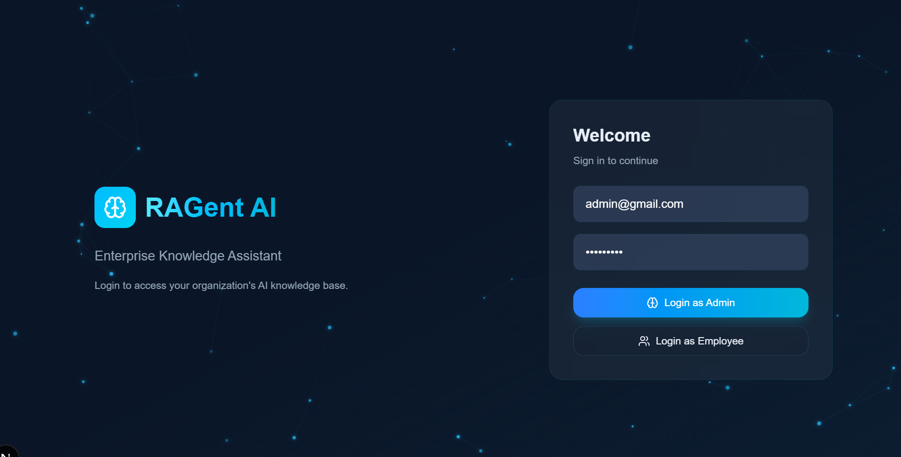
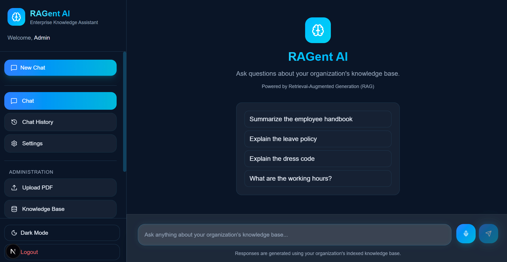
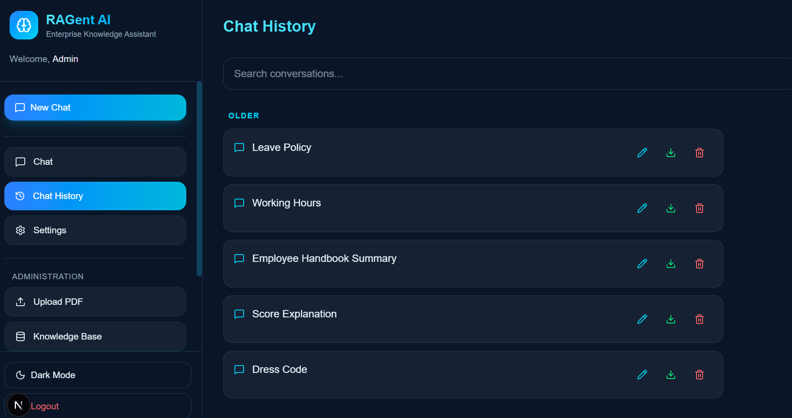
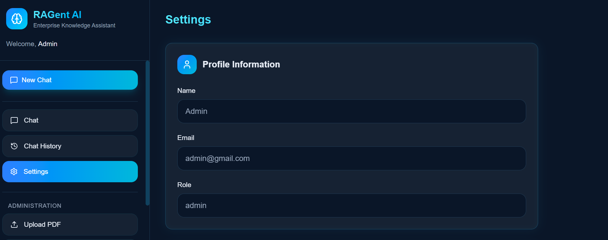
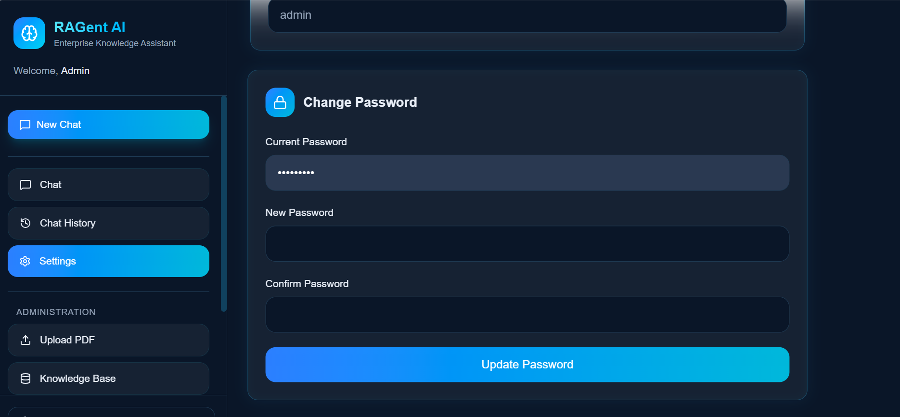
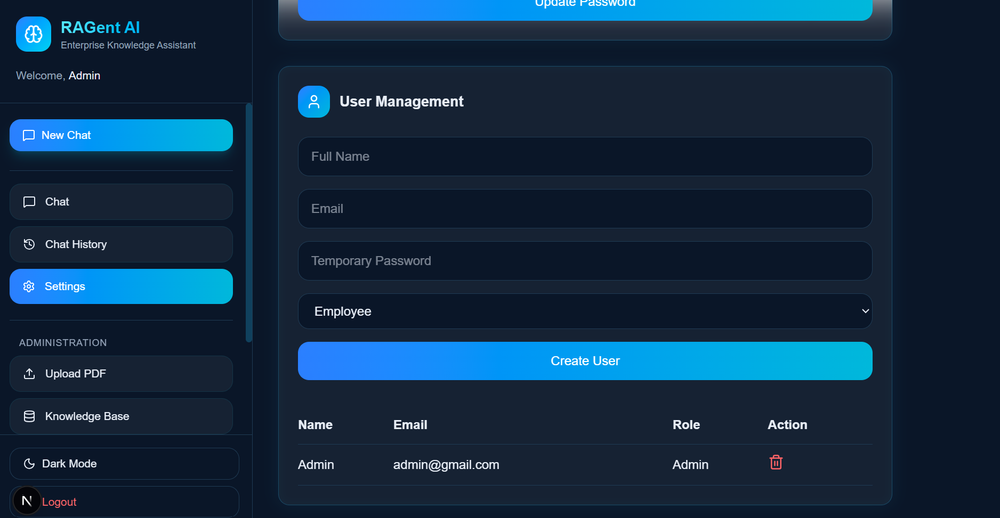
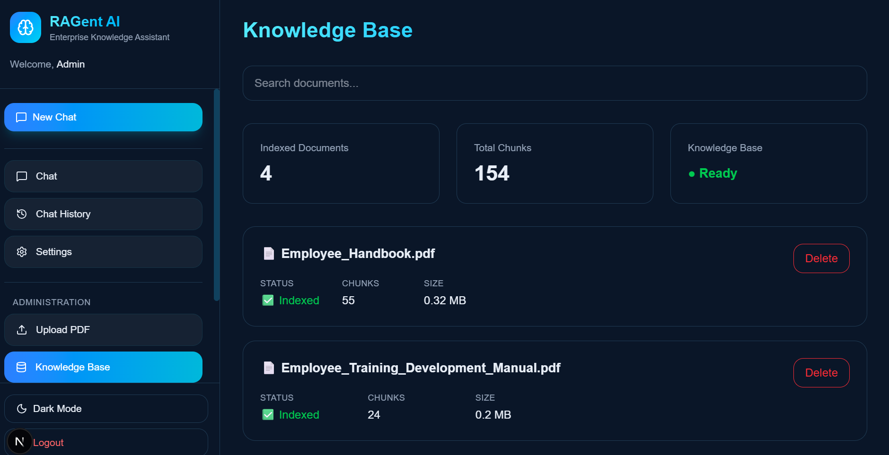
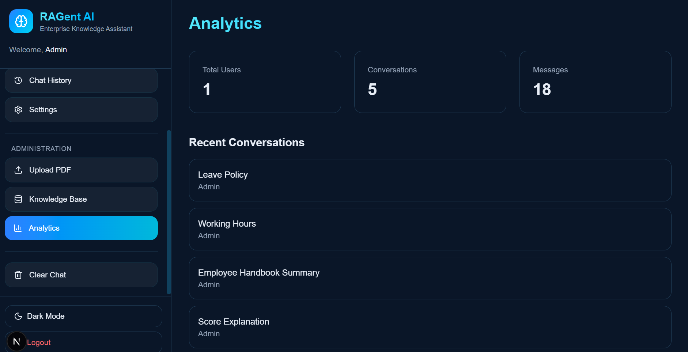

<h1 align="center">
🤖 RAGent AI — Enterprise Knowledge Assistant
</h1>

<p align="center">
An enterprise-grade Retrieval-Augmented Generation (RAG) assistant that enables employees to retrieve accurate information from organizational documents using AI-powered semantic search, vector embeddings, and Large Language Models.
</p>

<p align="center">


</p>

---

# 📖 Overview

RAGent AI is an Enterprise Knowledge Assistant designed to help employees retrieve information from company documents through natural language conversations.

The system combines Retrieval-Augmented Generation (RAG), semantic search, vector embeddings, and Large Language Models to provide accurate, context-aware answers with source citations.

Administrators can manage users, upload organizational documents, monitor analytics, and maintain the enterprise knowledge base, while employees can securely interact with the chatbot to access company information instantly.

---

# ✨ Features

### 🤖 AI Assistant

- Enterprise RAG Chatbot
- Semantic Document Search
- Context-Aware Responses
- Source Citations
- Persistent Conversations

### 📚 Knowledge Base

- Upload PDF Documents
- Automatic Text Chunking
- Embedding Generation
- ChromaDB Vector Storage
- Document Search
- Delete Documents

### 👥 User Management

- JWT Authentication
- Admin & Employee Roles
- Role-Based Access Control
- Password Management
- User Creation

### 📈 Analytics

- Total Users
- Total Conversations
- Total Messages
- Recent Conversations

### 💬 Chat Management

- New Chat
- Chat History
- Conversation Search
- Rename Conversations
- Delete Conversations

### 🎨 UI Features

- Responsive Design
- Dark / Light Theme
- Modern Enterprise Dashboard
- Professional Admin Panel

---

# 🏗️ System Architecture

```
                  User

                    │

                    ▼

           Next.js Frontend

                    │

                    ▼

            FastAPI Backend

        ┌───────────┴────────────┐

        ▼                        ▼

    SQLite DB              ChromaDB

        ▼                        ▼

 Authentication          Vector Embeddings

        │                        │

        └──────────► Large Language Model
```

---

# 🛠️ Tech Stack

## Frontend

- Next.js
- React
- TypeScript
- Tailwind CSS
- Lucide Icons

## Backend

- FastAPI
- SQLAlchemy
- JWT Authentication
- Passlib
- SQLite

## AI Stack

- LangChain
- Sentence Transformers
- ChromaDB
- Hugging Face Embeddings
- PyPDF

---

# 📸 Screenshots

## 🔐 Login



---

## 💬 AI Chat



---

## 🕒 Chat History

Search, rename, export, and delete previous conversations.



---

## ⚙️ Settings

### Profile Information



### Change Password



### User Management (Admin)



---

## 📚 Knowledge Base

Upload PDFs, view indexed documents, monitor chunk count, and manage the enterprise knowledge base.



---

## 📊 Analytics Dashboard

Monitor users, conversations, messages, and recent activity.


# 📂 Project Structure

```text
AI-Knowledge-Assistant/

│

├── chatbot/
│   ├── main.py
│   ├── models.py
│   ├── database.py
│   ├── security.py
│   ├── build_database.py
│   └── ...

├── data/
│   ├── Employee_Handbook.pdf
│   ├── document_metadata.json
│   └── ...

├── vector_db/

├── frontend/
│   ├── app/
│   ├── components/
│   └── ...

├── requirements.txt

└── README.md
```

---

# 🚀 Installation

## Clone Repository

```bash
git clone https://github.com/Mehnaz213/AI-Knowledge-Assistant.git

cd AI-Knowledge-Assistant
```

---

## Backend

```bash
python -m venv venv

venv\Scripts\activate

pip install -r requirements.txt

uvicorn chatbot.main:app --reload
```

---

## Frontend

```bash
cd frontend

npm install

npm run dev
```

---

# 🚀 Future Improvements

- Agentic AI Workflow
- Multi-Step Retrieval Planning
- Intelligent Query Expansion
- Confidence-Based Retrieval
- Multi-Document Reasoning
- Advanced RAG Evaluation
- Cloud Deployment

---

# 👩‍💻 Author

**Fathima Mehnaz**

Artificial Intelligence & Machine Learning Engineering Student

GitHub:
https://github.com/Mehnaz213

LinkedIn:
https://www.linkedin.com/in/fathima-mehnaz
